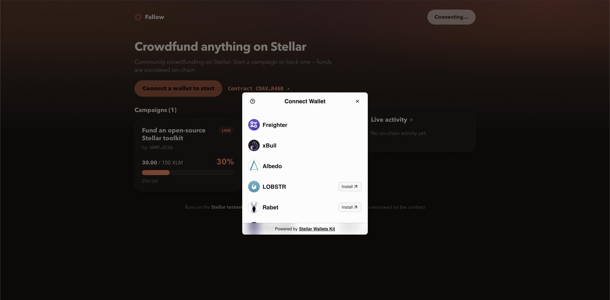
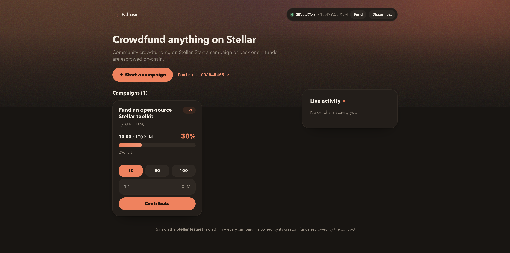
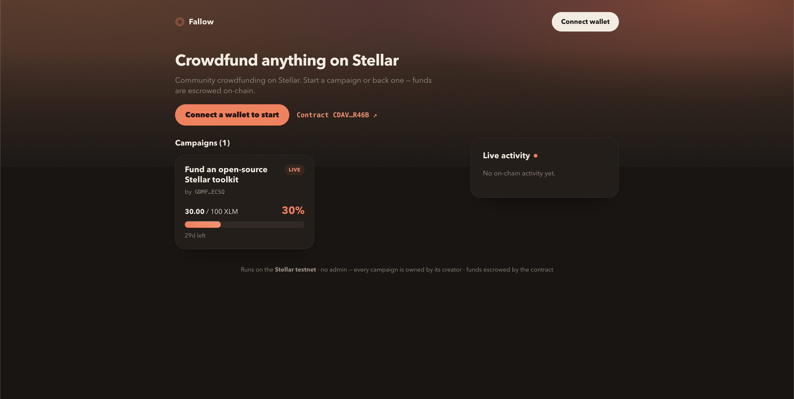
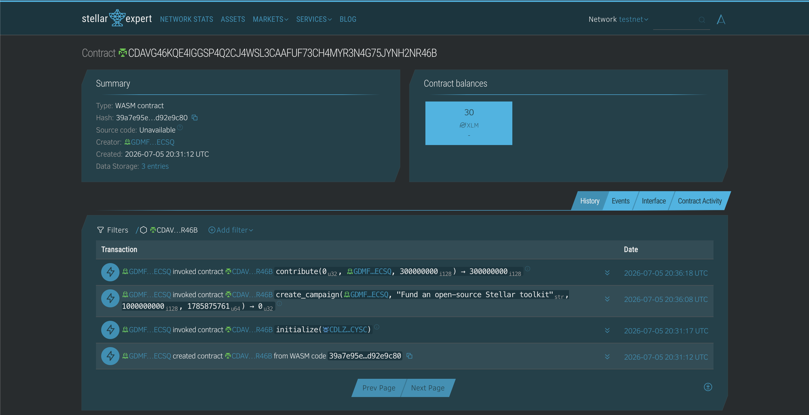

# ◎ Fallow — Stellar Crowdfunding

A crowdfunding dApp built for **Level 2 – Yellow Belt** of the Stellar frontend challenge. It's a **campaign factory**: connect **any** Stellar wallet and either **start a campaign** or **contribute** to an existing one. Contributions are real testnet XLM held in **escrow by a Soroban smart contract**, and progress updates in real time.

**There is no privileged admin.** Whoever creates a campaign is its owner and sole beneficiary — they (and only they) can withdraw once the goal is met. Backers can refund themselves if a campaign's deadline passes without reaching its goal. The account that deployed the contract has no special powers.

- ✅ **Screenshot: wallet options available** — [StellarWalletsKit connect modal](#wallet-options-available-stellarwalletskit) (`screenshots/AllProvidor.png`)
- ✅ **Deployed contract address** — [`CDAVG46KQE4IGGSP4Q2CJ4WSL3CAAFUF73CH4MYR3N4G75JYNH2NR46B`](https://stellar.expert/explorer/testnet/contract/CDAVG46KQE4IGGSP4Q2CJ4WSL3CAAFUF73CH4MYR3N4G75JYNH2NR46B)
- ✅ **Transaction hash of a contract call** (verifiable on Stellar Explorer) — `contribute`: [`249515a9d3752b6e05ca33ae3b5adeaa80cae384520412574e7381b1df65ecad`](https://stellar.expert/explorer/testnet/tx/249515a9d3752b6e05ca33ae3b5adeaa80cae384520412574e7381b1df65ecad)

## What it does

- 🔌 **Multi-wallet** connect via StellarWalletsKit — Freighter, xBull, Albedo, Lobstr, Rabet, Hana.
- 🏗️ **Anyone can create a campaign** (title, goal, duration) — the creator becomes its owner.
- 💸 **Contribute** real testnet XLM to any campaign; the contract escrows the funds.
- 📊 **Live progress** — each campaign shows raised / goal / % / time-left, polled from contract state.
- 📡 **Real-time activity feed** — contract events (`created` / `contrib` / `reached` / `withdrawn` / `refund`) streamed by polling Soroban RPC's `getEvents`.
- ⏳ **Transaction status tracking** — every action shows building → signing → pending → success/fail, with a stellar.expert link.
- 🧯 **Error handling** — three headline categories caught and shown distinctly: **wallet not found**, **request rejected**, **insufficient balance** (plus a generic fallback).
- 🏦 **Escrow rules on-chain** — creator `withdraw` once the goal is met; backer `refund` after a failed deadline.

## Deployed contract (testnet)

| | |
|---|---|
| Contract ID | [`CDAVG46KQE4IGGSP4Q2CJ4WSL3CAAFUF73CH4MYR3N4G75JYNH2NR46B`](https://stellar.expert/explorer/testnet/contract/CDAVG46KQE4IGGSP4Q2CJ4WSL3CAAFUF73CH4MYR3N4G75JYNH2NR46B) |
| Example contract call | `contribute` — tx [`249515a9d375…65ecad`](https://stellar.expert/explorer/testnet/tx/249515a9d3752b6e05ca33ae3b5adeaa80cae384520412574e7381b1df65ecad) |
| Token collected | Native XLM SAC `CDLZFC3SYJYDZT7K67VZ75HPJVIEUVNIXF47ZG2FB2RMQQVU2HHGCYSC` |
| Admin | none — each campaign is owned by its creator |
| Network | Stellar Testnet |

## Tech Stack

| Layer | Choice |
|---|---|
| Smart contract | Rust + `soroban-sdk` 26, deployed with Stellar CLI 27 |
| Framework | Next.js 15 (App Router) + React 19 + TypeScript |
| Wallets | `@creit.tech/stellar-wallets-kit` (StellarWalletsKit) |
| Chain access | `@stellar/stellar-sdk` **Soroban RPC** (simulate / prepare / send / getEvents) |

**Horizon vs Soroban RPC:** Level 1 talked to **Horizon** (the classic API for payments & balances). Smart-contract calls go through **Soroban RPC** (`soroban-testnet.stellar.org`) instead — used to *simulate* reads, *prepare* (assemble auth + footprint) and *send* writes, and stream contract *events*. Soroban has no websockets, so "real-time" here means polling `getEvents` + contract state on a 5s interval.

## The smart contract

Rust source is in [`contract/crowdfund/`](contract/crowdfund/src/lib.rs). Functions:

| Function | Who | Effect |
|---|---|---|
| `initialize(token)` | anyone, once | records the token the factory collects (native XLM SAC) |
| `create_campaign(creator, title, goal, deadline)` → id | anyone | creates a campaign owned by `creator`; emits `created` |
| `contribute(id, from, amount)` | anyone | escrows `amount` into campaign `id`; emits `contrib` (+ `reached` when the goal is crossed) |
| `withdraw(id)` | campaign creator | sends the campaign's escrow to its creator — only once the goal is met |
| `refund(id, from)` | backer | returns a backer's contribution — only after the deadline if the goal was missed |
| `get_campaigns(start, limit)` / `get_campaign(id)` / `get_campaign_count()` / `get_contribution(id, who)` | anyone (read) | campaign list / one campaign / count / a backer's total |

### Build, test & deploy it yourself

```sh
cd contract
cargo test                       # 7 unit tests
stellar contract build           # -> target/wasm32v1-none/release/crowdfund.wasm

stellar keys generate deployer --network testnet --fund
CID=$(stellar contract deploy --wasm target/wasm32v1-none/release/crowdfund.wasm \
  --source deployer --network testnet)
TOKEN=$(stellar contract id asset --asset native --network testnet)
stellar contract invoke --id "$CID" --source deployer --network testnet -- initialize --token "$TOKEN"
```

The deployer gets **no special powers** — it only uploads the code and records the token. Put the new `$CID` in `src/lib/config.ts` (or set `NEXT_PUBLIC_CONTRACT_ID`).

## Getting Started

### Prerequisites

- [Node.js](https://nodejs.org) 18.18+
- A Stellar wallet extension set to **Testnet** (e.g. [Freighter](https://freighter.app) → Settings → Network → Testnet)

### Run the frontend

The deployed testnet contract is baked into `src/lib/config.ts`, so no env setup is needed:

```sh
git clone https://github.com/HimanshuM685/Fallow.git
cd Fallow
npm install
npm run dev
```

Open http://localhost:3000 in a browser with a Stellar wallet installed.

### Build for production

```sh
npm run build
npm run start
```

## How to use

1. **Connect wallet** → pick any wallet in the StellarWalletsKit modal.
2. If your account is unfunded, click **Fund** (Friendbot) in the header.
3. **Start a campaign** — give it a title, goal, and duration, then sign one transaction. You own it.
4. Or **contribute** to any campaign: pick/enter an amount and sign — watch the status go building → signing → pending → success.
5. Progress bars and the **Live activity** feed update automatically as events land on-chain.
6. On your own funded campaign, a **Withdraw** button appears. On a campaign that ended below its goal, backers see a **Refund** button.

## Requirements checklist (Level 2)

- ✅ **3 error types handled** — wallet not found, request rejected, insufficient balance (`describeError` in `src/lib/soroban.ts`).
- ✅ **Contract deployed on testnet** — see contract ID above.
- ✅ **Contract called from the frontend** — reads via simulation, writes via prepare → sign → send (`src/lib/soroban.ts`).
- ✅ **Transaction status visible** — building / signing / pending / success / fail on every action.
- ✅ **Real-time event integration** — `getEvents` polling drives the live feed + progress.

## Screenshots

> All screenshots are on the **Stellar testnet**.

### Wallet options available (StellarWalletsKit)

Connect modal listing every supported wallet — Freighter, xBull, Albedo, LOBSTR, Rabet (Hana below the fold).



### Wallet connected — balance displayed

Header chip shows the connected address and live XLM balance, with **Fund** (Friendbot) and **Disconnect**. The campaign card exposes contribute presets and a **Start a campaign** action.



### Before connecting

Landing state before a wallet is connected — campaigns and progress are readable without signing in.



### On-chain confirmation (stellar.expert)

The deployed contract on stellar.expert — 30 XLM escrowed and the full call history (`create contract` → `initialize` → `create_campaign` → `contribute`).



## Project structure

```
contract/
└── crowdfund/
    ├── src/lib.rs          # crowdfunding factory (escrow) contract
    └── src/test.rs         # 7 unit tests
src/
├── app/
│   ├── layout.tsx          # root layout + metadata
│   ├── globals.css         # theme tokens + all component styles
│   └── page.tsx            # "/" → App (client-only, ssr:false)
├── components/
│   └── Campaign.tsx        # App shell: connect, create, browse, contribute, activity
└── lib/
    ├── config.ts           # contract id, SAC id, RPC url, app copy
    ├── soroban.ts          # Soroban RPC: reads, writes, events, errors
    └── wallet.ts           # StellarWalletsKit multi-wallet connector
```

## Notes

- Runs **exclusively on the Stellar testnet** — no real funds involved.
- Contributions actually move XLM: `contribute` calls the native Stellar Asset Contract's `transfer` to pull funds into the contract, authorized by the connected wallet's signature.
- Contract state TTL is extended on each write so a testnet campaign doesn't get archived mid-demo.
