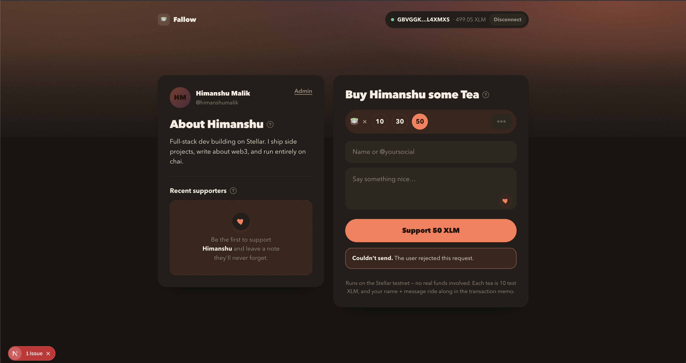
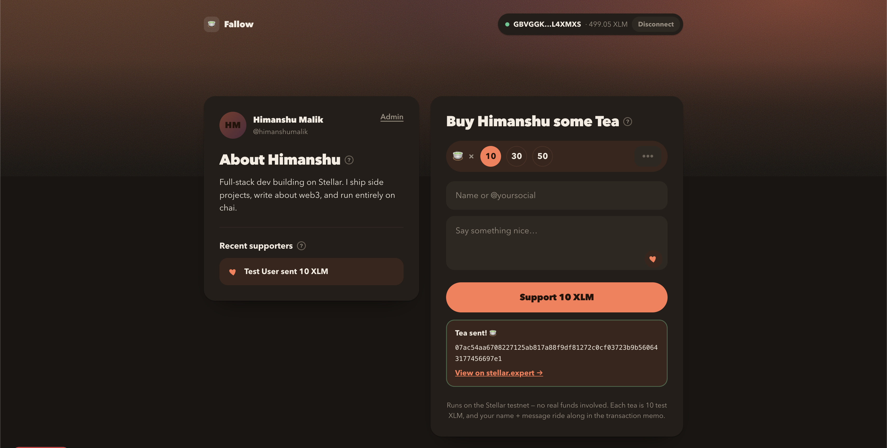
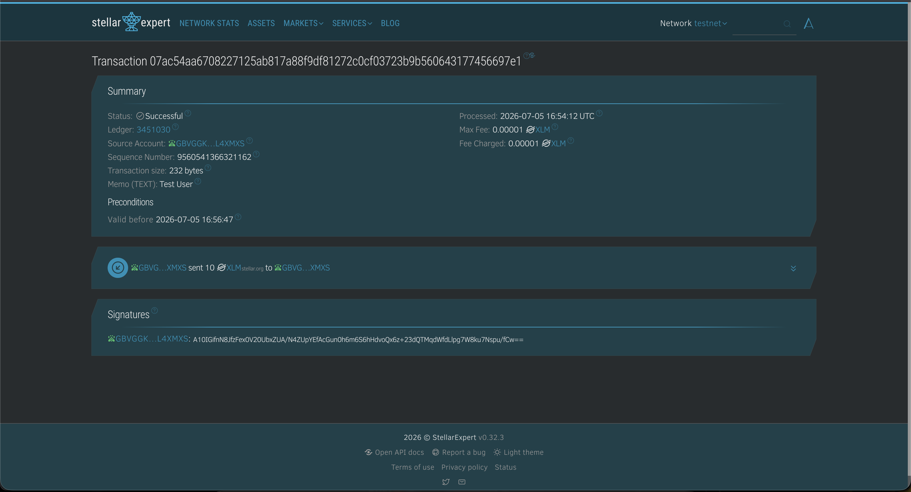
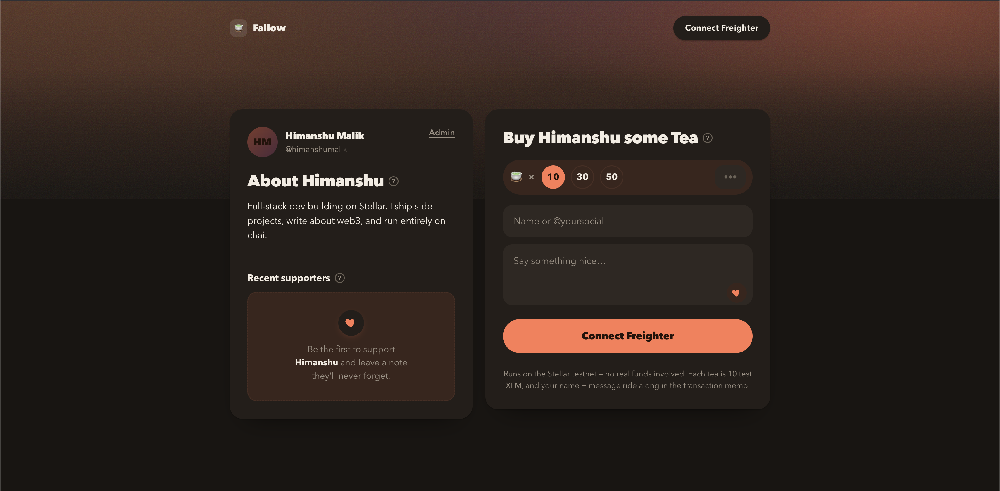

# 🍵 Fallow — Stellar Testnet Tip Jar

A creator tip-jar dApp built for **Level 1 – White Belt** of the Stellar frontend challenge. Connect your [Freighter](https://freighter.app) wallet and buy **Himanshu** a tea on the **Stellar testnet** — every tip is a real on-chain XLM payment, and the supporter's name + message ride along in the transaction memo.

## Features

- 🔗 **Wallet connect / disconnect** via the Freighter browser extension
- 💰 **Live XLM balance** fetched from Horizon testnet
- 🚰 **Friendbot funding** — one click to fund a new testnet account with test XLM
- 🍵 **Buy a tea** — 10 / 30 / 50 XLM presets (one tea = 10 XLM) or a custom amount
- ✍️ **On-chain memo** — the supporter's name + message are written into the payment memo (28-byte Stellar limit)
- ✅ **Transaction feedback** — success state with the tx hash and a [stellar.expert](https://stellar.expert/explorer/testnet) link, or a readable error
- 🔒 **Admin dashboard** at `/admin` — password-protected, reads all donations to the receiving wallet straight from Horizon (totals, supporters, per-tip memos)

## Tech Stack

| Layer | Choice |
|---|---|
| Framework | Next.js 15 (App Router) + React 19 + TypeScript |
| Wallet | `@stellar/freighter-api` |
| Stellar | `@stellar/stellar-sdk` (Horizon testnet) |
| Auth | Env-based password + httpOnly cookie, enforced in `middleware.ts` |

## Getting Started

### Prerequisites

- [Node.js](https://nodejs.org) 18.18+
- [Freighter wallet](https://freighter.app) browser extension, switched to **Testnet** (Settings → Network)

### Run locally

```sh
git clone https://github.com/HimanshuM685/Fallow.git
cd Fallow
npm install

# set the admin dashboard password
cp .env.example .env.local
# then edit .env.local and set ADMIN_PASSWORD=your-secret

npm run dev
```

Open http://localhost:3000 in the browser where Freighter is installed. The admin dashboard is at http://localhost:3000/admin (you'll be redirected to `/login`).

### Build for production

```sh
npm run build
npm run start
```

## How to Use

1. Click **Connect Freighter** and approve the connection.
2. If your account isn't funded on testnet, use **Fund with Friendbot**.
3. Pick a tea amount (10 / 30 / 50 XLM or custom), add your name + a message, and click **Support N XLM**.
4. Approve the transaction in Freighter — the name + message are saved to the on-chain memo. You'll get the tx hash and a stellar.expert link.
5. Visit **/admin**, enter the password from `.env.local`, and see every donation to the receiving wallet.

## Configuration

- **Receiving wallet & creator details** live in `src/lib/config.ts`.
- **Admin password** is `ADMIN_PASSWORD` in `.env.local` (gitignored). It is validated server-side in `src/app/api/login/route.ts` and the cookie is enforced by `src/middleware.ts` — the password is never shipped to the browser bundle.

## Screenshots

> All screenshots are on the **Stellar testnet** — no real funds involved.

### Wallet connected & balance displayed

The header shows the connected account `GBVGGK…L4XMXS` with a **Disconnect** button and the live **499.05 XLM** balance fetched from Horizon.



### Successful testnet transaction — result shown to the user

After signing in Freighter, the app shows a **"Tea sent! 🍵"** confirmation with the transaction hash and a stellar.expert link, and the new supporter appears under **Recent supporters**.



### On-chain confirmation (stellar.expert)

The same transaction on [stellar.expert](https://stellar.expert/explorer/testnet) — **Status: Successful**, network **testnet**, memo **"Test User"**, 10 XLM transferred.



<details>
<summary>Landing page (before connecting)</summary>



</details>

## Project Structure

```
src/
├── app/
│   ├── layout.tsx          # root layout + metadata
│   ├── globals.css         # theme tokens + all component styles
│   ├── page.tsx            # "/" → tip page
│   ├── admin/page.tsx      # "/admin" → dashboard (gated by middleware)
│   ├── login/page.tsx      # "/login" → password form
│   └── api/login|logout/   # auth route handlers
├── components/
│   ├── TipJar.tsx          # tip UI: connect, balance, tea widget, tx feedback
│   └── Admin.tsx           # donations dashboard (reads Horizon)
├── lib/
│   ├── stellar.ts          # Horizon client: balance, Friendbot, payment, donations
│   └── config.ts           # receiving address, creator details, tea pricing
└── middleware.ts           # gates /admin behind the ADMIN_PASSWORD cookie
```

## Notes

- Runs **exclusively on the Stellar testnet** — no real funds involved.
- Payments are built with `TransactionBuilder`, signed by Freighter (keys never leave the extension), and submitted to Horizon (`https://horizon-testnet.stellar.org`).
- Horizon result codes (e.g. `op_underfunded`, `op_no_destination`) are translated into readable error messages.
- Stellar text memos are capped at **28 bytes**, so long name + message combinations are truncated for the on-chain record.
