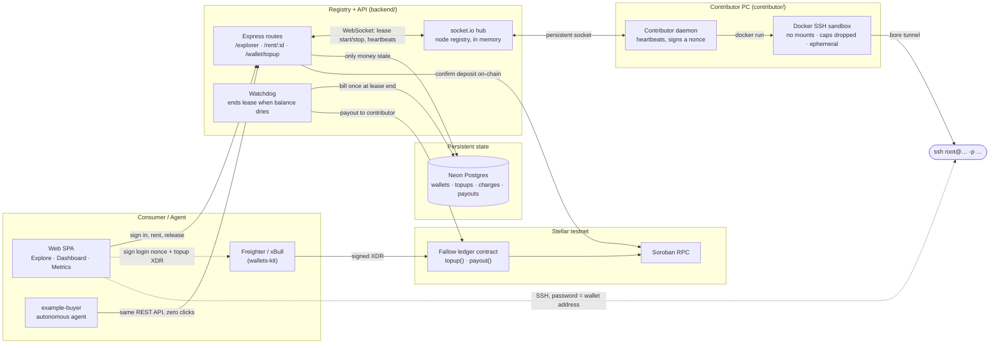
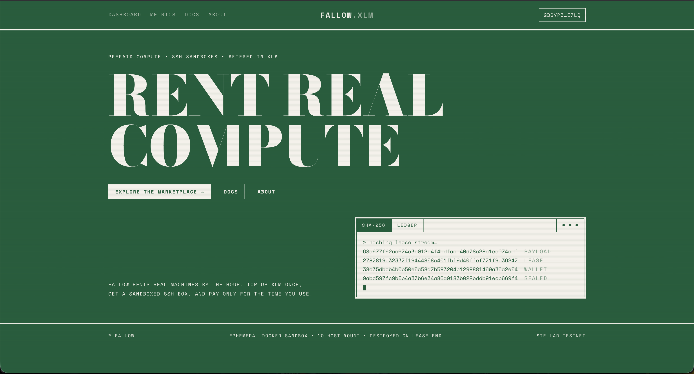
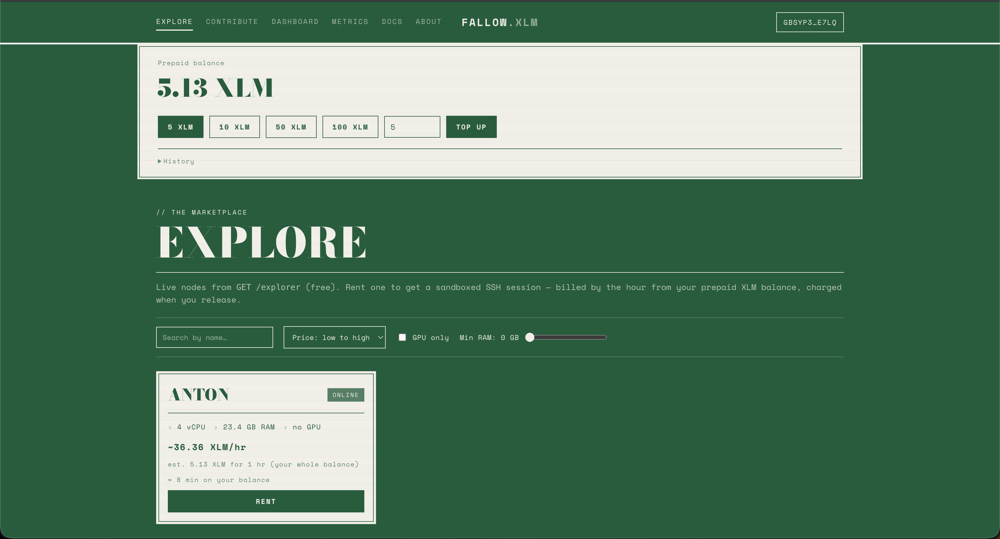
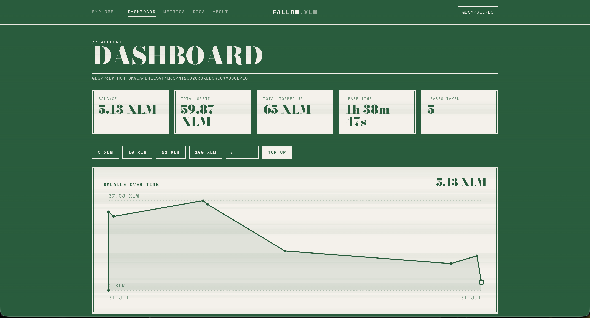
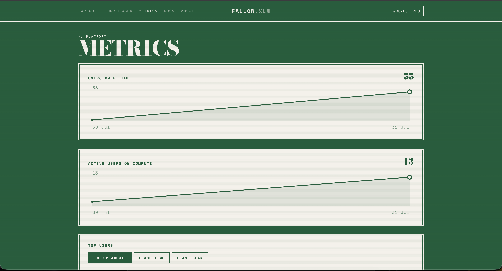
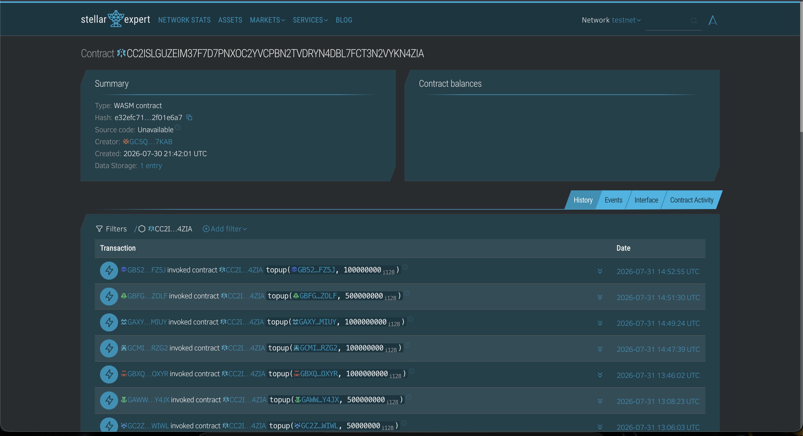
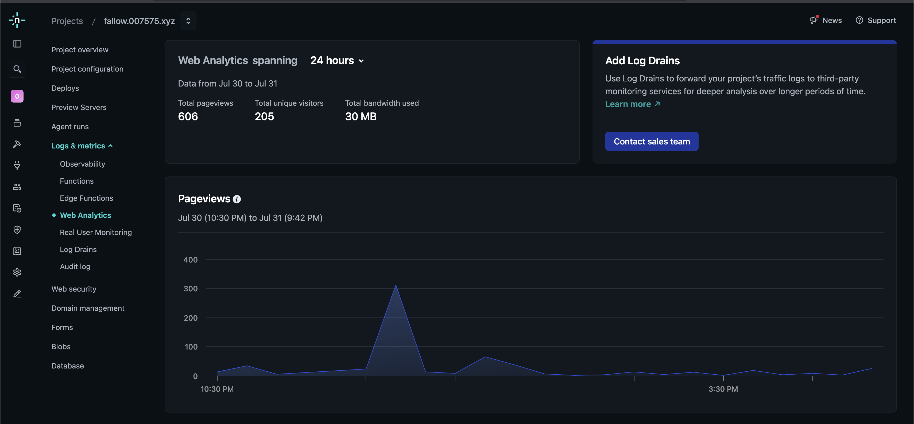

# 🌿 Fallow

**A prepaid compute marketplace for individual contributors — metered in native XLM on Stellar.**

Think Akash or io.net, but for *individuals* instead of data centers. Anyone can rent out their PC's
CPU/RAM/GPU. A renter — human or AI agent — tops up an XLM balance once, rents a node, and gets a
sandboxed SSH session billed by the hour.

No per-action signing. No x402. You pay for the time you actually used.

> **Evaluating this project?** Start with either:
>
> - 📊 **[Technical pitch deck & future roadmap](https://drive.google.com/file/d/1p0R7P4XE_koQu7b1wOVTJR2nqOdfSIHr/view?usp=sharing)** — the short version, plus where this goes next.
> - 📄 **[WHITEPAPER.md](./WHITEPAPER.md)** — the full writeup: trust model, billing math, the custodial
>   tradeoff, and the ledger contract.
>
> This README is about running the thing.

---

## Contents

1. [The Problem](#1-the-problem)
2. [How It Works](#2-how-it-works)
3. [Features](#3-features)
4. [The Trust Model](#4-the-trust-model)
5. [The Stellar Advantage](#5-the-stellar-advantage)
6. [Architecture](#6-architecture)
   - [System Architecture](#system-architecture)
   - [CI/CD Pipeline](#cicd-pipeline)
7. [Tech Stack](#7-tech-stack)
8. [Setup & Local Development](#8-setup--local-development)
9. [End-to-End Walkthrough](#9-end-to-end-walkthrough)
10. [Project Structure](#10-project-structure)
11. [Feedback Iteration Tracker](#11-feedback-iteration-tracker)
12. [On-Chain Info](#12-on-chain-info)
13. [Screenshots](#13-screenshots)
14. [Pitch Deck & Presentation](#14-pitch-deck--presentation)
15. [Future Enhancements](#15-future-enhancements)

---

## 1. The Problem

Spare compute is everywhere and almost none of it is rentable. A gaming rig idles 20 hours a day; a
workstation sits dark overnight. The DePIN compute market that exists today — Akash, io.net — is
built for **data centers**: rack operators with static IPs, ops teams, and inventory to commit. An
individual with one good machine has no practical way in.

On the demand side, renting compute normally means an account, a card, and a billing relationship.
That works for humans and fails for **autonomous agents**, which are increasingly the ones that want
an hour of GPU time at 3am.

Crypto-native alternatives trade one friction for another:

- **Per-action signing.** Every call needs a wallet prompt (x402-style). A human tolerates it; an
  agent loop can't, and a wallet popup mid-session breaks the flow entirely.
- **Per-tick settlement.** Metering by the second on-chain means a transaction per tick — noisy, and
  on most chains the fees swamp the compute being sold.
- **Opaque off-chain ledgers.** The alternative — an internal balance nobody can audit — is just a
  database with extra steps.

Fallow's answer is narrow on purpose: **prepay once, spend without signing, settle once on-chain.**
One signature to top up, zero to rent, and a single public payout when the lease ends.

## 2. How It Works

1. **Sign in** — you sign a nonce with your wallet to prove you control the address.
2. **Top up** — you call `topup(from, amount)` on the Fallow ledger contract. The registry confirms
   the deposit on-chain and credits an off-chain balance.
3. **Rent** — spends from that balance, no signing. You get an SSH command and a countdown.
4. **Release** — the lease is billed once, `elapsed/3600 × hourly rate`, and the contributor is paid
   on-chain minus a platform fee. The sandbox is destroyed.

A lease also ends on its own when the balance runs out, so you can't overdraw.

Nodes are priced in USD per hour (`PRICE_PER_HOUR_USD`) and converted to a stroops/hour rate at a
configurable `XLM_USD_PRICE`. Deposits, charges, and payouts are all kept as history.

## 3. Features

**For renters**

- **Connect Wallet in the nav from the landing page on** — the address chip opens a dropdown with
  balance, top-up, copy address, history, and disconnect.
- **Explore** — search by name, sort by price, filter to GPU-only, and set a minimum-RAM floor. Each
  card shows the hourly rate *and* an estimated cost for an hour before you commit.
- **Live lease panel** — a balance-driven countdown next to a ticking **"X XLM spent so far"**, the
  copyable SSH command and password, and a release button behind a confirm. Shown on both Explore and
  the Dashboard, so a running lease is never more than one click away.
- **Dashboard** — lifetime stats, an inline top-up control, a balance-over-time chart, and full
  spend/top-up history with links to every transaction on a testnet explorer.
- **Metrics** — platform growth, daily active compute users, and leaderboards that highlight your own
  row (pinning it below the list, at its true rank, if you're outside the top 20).

**For contributors**

- One command to share a machine; the daemon proves node ownership by signing a nonce, then
  heartbeats.
- Paid **on-chain** at lease end, to your own address, minus a platform fee.
- A **contributor leaderboard** ranked on time served and leases served — a reason to keep a node
  online past the demo.

**For agents** — two endpoints are all an autonomous buyer needs:

- `GET /explorer` — **free**, so an agent can survey live nodes (specs + price) and pick one itself.
  `GET /leaderboard[?address=G…]` is free too, returning the top 20 plus that address's own rank.
- `POST /rent/:nodeId` — starts an hourly-metered session against the prepaid balance, no per-rent
  signing. Billed once at release, prorated, and auto-stopped when the balance runs out — so an agent
  only ever burns money on compute it actually used. Top up ahead of time with `POST /wallet/topup`.

## 4. The Trust Model

A contributor gives *compute*, never filesystem or account access. The boundary isn't a permissions
system — it's an ephemeral Docker container:

- no host filesystem mounts (`-v` is never used)
- no inbound host ports — the sandbox dials *out* over a [bore](https://github.com/ekzhang/bore)
  tunnel for SSH (in local mode it publishes SSH only to `127.0.0.1`)
- nearly all Linux capabilities dropped (`--cap-drop ALL` plus the handful sshd needs, and
  `--security-opt no-new-privileges`)
- hard CPU / memory / PID caps via cgroups
- destroyed the moment the paid lease ends

This is the same containerization trade-off the whole DePIN compute sector runs on. Fallow just makes
it prepaid and individual-scale. Full detail in [WHITEPAPER.md §2](./WHITEPAPER.md).

## 5. The Stellar Advantage

The prepaid model only works if settling on-chain is cheap enough to do per lease, and simple enough
that neither side has to set anything up. Stellar gives both:

- **Native XLM needs no trustline.** A renter tops up and a contributor gets paid in the network's
  own asset — no token opt-in, no asset issuance, no approval step. On a chain with ERC-20-style
  allowances, that's two extra transactions before anyone has done anything.
- **Fees are negligible and finality is seconds.** A base-fee transaction costs a rounding error and
  settles in about five seconds, which is what makes a real on-chain payout *per lease* sane. The same
  design on a chain with dollar-scale fees would eat the margin on a one-hour rental.
- **Soroban holds the audit trail without holding the funds.** The ledger contract relays each top-up
  and payout and emits a public event. It never custodies a balance — so the money movement is
  verifiable on a block explorer, while the contract stays small enough to read in one sitting.
- **The wallet story is solved.** `@creit.tech/stellar-wallets-kit` covers Freighter, xBull, Albedo and
  friends behind one picker, so sign-in is a signature and nothing more.
- **Testnet is a real environment.** Friendbot funds accounts instantly and the same contract,
  addresses, and RPC flow carry to mainnet — no mock chain, no local-only shortcuts.

## 6. Architecture

### System Architecture



### CI/CD Pipeline

> **Status: not automated yet.** There is no `.github/workflows/` in this repo — every gate below runs
> locally today. The diagram is the release path as it exists, drawn so it can be lifted into GitHub
> Actions as-is. Dashed boxes are the steps still done by hand.


Notes on why it's shaped this way:

- **`build:shared` gates everything.** Both the backend and the web app import `@fallow/shared`, so a
  stale `dist/` fails the typecheck rather than shipping a mismatch.
- **Contributor agents are never deployed by the pipeline.** They run on contributors' own machines and
  reconnect to the registry over WebSocket, so a backend deploy just drops their sockets — the node
  re-registers on its next heartbeat.
- **`VITE_REGISTRY_URL` is baked in at build time**, so the web app has to be rebuilt (not just
  re-uploaded) when the backend URL changes.
- **Contract deploys are deliberately manual.** A redeploy mints a new `CONTRACT_ID` that every service
  has to be pointed at, so it should never fire off a merge.

## 7. Tech Stack

| Layer | What's used | Why |
|---|---|---|
| **Contract** | Rust + `soroban-sdk` 26.1 (`wasm32v1-none`) | Relays top-ups and payouts, emits public events, custodies nothing |
| **Backend** | Node 22, Express 4, socket.io 4, `pg` 8 → Neon Postgres, `jsonwebtoken`, `nanoid`, `tsx` | REST + a WebSocket hub in one process; JWT sessions and lease tokens |
| **Chain access** | `@stellar/stellar-sdk` 16 | Confirms deposits on-chain, submits payouts, builds the top-up XDR |
| **Web** | React 18, React Router 7, Vite, `@creit.tech/stellar-wallets-kit` 2.5 | Client-only wallet stack, so an SPA instead of Next.js — no SSR/hydration friction |
| **Contributor** | Node + `socket.io-client`, host Docker via the mounted socket | Launches each sandbox as a sibling container; nothing extra to install |
| **Sandbox** | Docker + sshd, exposed over a [bore](https://github.com/ekzhang/bore) tunnel | Ephemeral, mount-less, caps dropped, no inbound ports needed |
| **Shared** | TypeScript project references (`@fallow/shared`) | One source of truth for types, the WebSocket contract, and pricing math |
| **Charts** | Hand-rolled inline SVG | No charting dependency for four small charts |

## 8. Setup & Local Development

### Prerequisites

- Node 22+ and npm
- A **Neon** Postgres database (free at [neon.tech](https://neon.tech)) — its connection string is
  `DATABASE_URL`
- A **platform Stellar account** (`G…`) that receives top-ups and pays contributors. Its address is
  `PLATFORM_PAYTO`, its secret seed (`S…`) is `PLATFORM_PRIVATE_KEY` — both come from one
  `npm run keygen`
- A deployed **ledger contract** (`CONTRACT_ID`) — see [contract/README.md](./contract/README.md)
- **Docker**, with the daemon running, for the contributor's SSH sandboxes
- An **SSH client** (built into macOS/Linux/Windows). Public exposure uses an in-container bore
  tunnel, so there's nothing extra to install; use `TUNNEL_MODE=local` when the consumer and agent
  share a machine
- **Stellar testnet** accounts funded with XLM ([Friendbot](https://friendbot.stellar.org/)) — native
  XLM, no trustline or asset opt-in

> Full setup, account prep, and production deployment live in **[DEPLOY.md](./DEPLOY.md)**. The quick
> start below is for local dev.

### Quick start

Install once at the root, then run each piece in its own terminal. Every command has a root shortcut
and also works from inside its own folder.

```bash
npm install
npm run build:shared            # compiles @fallow/shared to dist/ — required before first run
cp .env.example .env            # set DATABASE_URL, PLATFORM_PAYTO, PLATFORM_PRIVATE_KEY
```

```bash
# 1. Backend / registry                          # http://localhost:4000
npm run backend                 # …or:  cd backend && npm run dev

# 2. Contributor agent — generate + fund a key first
npm run keygen                  # prints Address + STELLAR_PRIVATE_KEY  (cd contributor && npm run keygen)
STELLAR_PRIVATE_KEY=<key> PRICE_PER_HOUR_USD=1.0 npm run contributor   # …or:  cd contributor && npm run dev
#   the SSH sandbox image builds on the first rent, then it's cached
#   same machine as the consumer? add TUNNEL_MODE=local

# 3a. Web UI                                      # http://localhost:5173
cp web/.env.example web/.env    # set VITE_REGISTRY_URL (defaults to localhost:4000)
npm run web                     # connect Freighter → Sign in → Top up → Rent → copy the ssh command

# 3b. …or the autonomous agent (its own funded key)
STELLAR_PRIVATE_KEY=<buyer-key> npm run client       # …or:  cd example-buyer && npm run start
```

### Run with Docker

Each piece is its own Compose service. The backend usually lives on a server; a contributor runs on
each machine sharing compute and points at that backend via `REGISTRY_URL` in `.env`.

```bash
cp .env.example .env                     # then set REGISTRY_URL to your backend

docker compose up --build backend        # the backend / registry  → :4000
docker compose up --build contributor    # share THIS machine's compute
docker compose run  --rm   buyer         # one-shot autonomous buyer
```

The contributor doesn't run a Docker of its own. It mounts the host Docker socket and launches each
sandbox as a sibling container on the host daemon, so there's nothing extra to install. Just set
`REGISTRY_URL` (e.g. `http://YOUR_SERVER_IP:4000`) and bring it up.

- **backend** keeps only money state in Neon (`DATABASE_URL`) — no local volume. Set `PLATFORM_PAYTO`
  and `PLATFORM_PRIVATE_KEY` too.
- **contributor** needs no inbound ports in the default `TUNNEL_MODE=bore`. `network_mode: host` is
  only for `TUNNEL_MODE=local`, and on Docker Desktop (Mac/Windows) host networking doesn't share the
  loopback — so for local mode, run the contributor natively with `npm run contributor`.

### Web app (static SPA)

The web app isn't a container. It's a static build you can host anywhere:

```bash
VITE_REGISTRY_URL=http://your-host:4000 npm run build -w web   # → web/dist
```

Drop `web/dist` on Vercel / Netlify / Cloudflare Pages / nginx — full steps in [DEPLOY.md](./DEPLOY.md).

### Configuration

All Node services read the repo-root `.env`, and each app's own `.env` overrides it. An inline
`FOO=bar npm run …` overrides both. The web app reads `web/.env` (`VITE_*` only, baked in at build
time). See [`.env.example`](./.env.example), [`web/.env.example`](./web/.env.example), and the env
tables in [DEPLOY.md](./DEPLOY.md).

### What's verified vs. what needs your machine

Compiles and builds clean: `npm run typecheck`, the web production build, and `npm run check -w shared`
for the money-formatting rules.

Running it end-to-end needs your environment: a Neon database (`DATABASE_URL`), a platform account
(`PLATFORM_PAYTO` + `PLATFORM_PRIVATE_KEY`), a deployed ledger contract (`CONTRACT_ID`), a running
Docker daemon, outbound network for the bore tunnel, an SSH client, and Soroban RPC reachable to
confirm top-ups and send payouts.

## 9. End-to-End Walkthrough

1. Start the **registry** and one **contributor** (a real machine sharing CPU/RAM).
2. Show the node appear in **Explore** at `http://localhost:5173`.
3. **Human path:** connect Freighter (testnet) from the nav → **Sign in** → **Top up** (approve one
   XLM deposit) → watch the balance appear → check the **est. cost per hour** on a node card → click
   **Rent** (no popup) → a copyable **`ssh root@… -p …`** command appears (password = your wallet
   address) with a balance-driven countdown and a **live "X XLM spent so far"** ticking beside it.
   `ssh` in. **Release** (confirm the charge in the prompt) or letting the balance hit zero bills the
   exact time used and destroys the sandbox. The same lease card is on the **Dashboard**.
4. **Autonomous path:** run `npm run client` and narrate the logs — the agent signs in, tops up if
   low, rents the cheapest node, runs a tiny training loop *on someone else's machine*, prints the
   falling loss, then releases and reports how much balance it drew down. No human clicked anything.
5. Show `docker ps` during the lease (a hardened, mount-less container) and that it's **gone** after
   release. On a testnet explorer, confirm the top-up *and* the **payout to the contributor**; in
   Neon, the single `charges` row (with the billed seconds) and the `payouts` row.

## 10. Project Structure

One npm-workspaces monorepo. Each folder is a self-contained piece you can `cd` into:

| Folder | What it is |
|---|---|
| `backend/` | The registry and API. Express + Neon (Postgres) + socket.io. Holds the node registry in memory, serves a free `/explorer`, handles wallet sign-in and top-ups, spends the balance on `/rent/:id`, runs a watchdog that ends a lease when the balance runs out, and pays the contributor on-chain at the end. Only money state hits the DB. |
| `contributor/` | The daemon a contributor runs. Proves node ownership by signing a nonce, heartbeats, and on a lease spins up a hardened Docker SSH sandbox exposed over a bore tunnel — torn down when the lease ends. |
| `web/` | The website. Vite + React + `@creit.tech/stellar-wallets-kit` (Freighter/xBull/…) — the pages listed in [Features](#3-features). |
| `example-buyer/` | A headless autonomous "training agent": signs in, tops up if low, discovers, rents, runs a script, releases. Zero clicks. |
| `shared/` | Shared types, the WebSocket contract, and pricing helpers — imported everywhere as `@fallow/shared`. |
| `contract/` | The Soroban ledger contract (Rust) plus deploy instructions. |

## 11. Feedback Iteration Tracker

Every item below came from a reviewer using the app, and every one shipped. Commits link to the change.

| # | Feedback | Commit |
|---|---|---|
| 1 | After approving the top-up in Freighter nothing happened on screen for a few seconds and I thought it failed. Needs a toast, or at least a "confirming on-chain…" state on the button until the balance updates. | [`1016827`](https://github.com/HimanshuM685/Fallow/commit/1016827a8e94e6c9518f15117748ccae17b6a761) |
| 2 | Add a Top up button on the dashboard itself. Right now I have to go into the wallet panel to do it, and that's the one action I do most. | [`4835674`](https://github.com/HimanshuM685/Fallow/commit/4835674be21cf552b479a369f97b525831b5b10d) |
| 3 | A contributor leaderboard would give people a reason to keep their node online past the demo — ranked on lease time served and total serving count. | [`fd449eb`](https://github.com/HimanshuM685/Fallow/commit/fd449ebce7b65209e0b02091636d0fd70f803fb5) · [`09fcc2a`](https://github.com/HimanshuM685/Fallow/commit/09fcc2ae2850915847536b8123e1637f4d8f653d) |
| 4 | The wallet address in the nav is dead text. Make it a dropdown with balance, Top up, History and Disconnect. I couldn't find how to switch accounts at all. | [`2e7f84a`](https://github.com/HimanshuM685/Fallow/commit/2e7f84ab1ce4120f24f78cfe8b66d3223de229eb) |
| 5 | No filters or sort. Past about ten nodes I'd want sort by price, filter by GPU present, and a minimum RAM slider. Also a search box. | [`b3fce24`](https://github.com/HimanshuM685/Fallow/commit/b3fce24b9db0676c8edb53cfb309bba791ff81b4) |
| 6 | There's no whitepaper or docs site. The README is good but I can't send a README to someone evaluating this. A proper writeup covering the trust model, the billing math, the custodial tradeoff and the roadmap would help a lot. | [`e7cfe24`](https://github.com/HimanshuM685/Fallow/commit/e7cfe2422d03083bf69c6542b91e73bd24a21440) |
| 7 | I want to see the money moving while the lease runs. Right now I get a time countdown but not a live cost figure. Show "0.42 XLM spent so far" ticking up next to the timer, and a rough total estimate before I click Rent. | [`65c898c`](https://github.com/HimanshuM685/Fallow/commit/65c898c7fc62f5f800b9cddaa750ccc0d6fa5d36) |
| 8 | Release has no confirmation. I clicked it while reading the logs and killed my own session. A small "End lease and destroy sandbox?" modal would have saved me. | [`1595c4f`](https://github.com/HimanshuM685/Fallow/commit/1595c4f592b5b3c40f1c94e693c9490d72019d8d) |
| 9 | The nav on the landing page has no Connect Wallet. I clicked Dashboard first and only then figured out I needed a wallet. Put the connect button in the nav from the start. | [`37d957c`](https://github.com/HimanshuM685/Fallow/commit/37d957ca03f66d259bd03dc73f42da0b90057d87) |
| 10 | The wallet chip in the nav (GARQ5W…4BNA) does nothing when clicked. Make it a dropdown with balance, Top up, Copy address, Disconnect. | [`041eed8`](https://github.com/HimanshuM685/Fallow/commit/041eed8b6434b79883b2538b2a189f7d798ceb86) |
| 11 | The charts are way too tall. Each one fills the whole screen, so I have to scroll to know a second chart exists. Cut the height by half and both fit at once. | [`a8814ae`](https://github.com/HimanshuM685/Fallow/commit/a8814ae) |
| 12 | My own row isn't highlighted. I had to scan for my address to find myself at #6. Highlight the connected wallet's row and pin it to the bottom if it's off the visible list. | [`0a043b9`](https://github.com/HimanshuM685/Fallow/commit/0a043b933a5cc107f8458740beb0b9144647c17d) |
| 13 | If I have a lease running, the Dashboard doesn't show it. Put an active lease card at the top with the countdown and the ssh command, so I don't have to go back to Explore to find it. | [`0a043b9`](https://github.com/HimanshuM685/Fallow/commit/0a043b933a5cc107f8458740beb0b9144647c17d) |
| 14 | Four decimal places everywhere is noisy. 60.0000 XLM and 120.0000 XLM would read better as 60 and 120 or 2 decimal places. Keep the full precision on hover or in history rows only. | [`0a043b9`](https://github.com/HimanshuM685/Fallow/commit/0a043b933a5cc107f8458740beb0b9144647c17d) |

## 12. On-Chain Info

Every top-up and payout goes through a small Soroban contract on Stellar testnet. It never holds any
money — it moves XLM from one wallet to another and leaves a public record, so anyone can verify a
transfer happened. Nothing hides in a database.

| | |
|---|---|
| **Network** | Stellar testnet |
| **Contract ID** | `CC2ISLGUZEIM37F7D7PNXOC2YVCPBN2TVDRYN4DBL7FCT3N2VYKN4ZIA` |
| **Explorer** | [stellar.expert →](https://stellar.expert/explorer/testnet/contract/CC2ISLGUZEIM37F7D7PNXOC2YVCPBN2TVDRYN4DBL7FCT3N2VYKN4ZIA) |
| **Functions** | `topup(from, amount)` · `payout(lease_id, contributor, user, amount)` · `get_platform()` |
| **Asset** | Native XLM (no trustline) |
| **Source + deploy your own** | [contract/README.md](./contract/README.md) |

## 13. Screenshots

| | |
|---|---|
| **Landing** — wallet connect lives in the nav from the first screen. <br>  | **Explore** — prepaid balance + top-up presets, search / price sort / GPU / min-RAM filters, and a per-node hourly rate with a cost estimate before you rent. <br>  |
| **Dashboard** — lifetime stats, an inline top-up control, and balance over time. <br>  | **Metrics** — platform growth, daily active compute users, and the sortable leaderboards. <br>  |

**Ledger contract on Stellar testnet** — real `topup()` invocations against the deployed contract, one per deposit:



**Web analytics on the deployed app** (`fallow.007575.xyz`) — 606 pageviews from 205 unique visitors in a 24-hour window:



## 14. Pitch Deck & Presentation

- 📊 **[Technical pitch deck & future roadmap](https://drive.google.com/file/d/1p0R7P4XE_koQu7b1wOVTJR2nqOdfSIHr/view?usp=sharing)** — the problem, the architecture, and where this goes next, in slide form.
- 📄 **[WHITEPAPER.md](./WHITEPAPER.md)** — trust model, exact billing math, the custodial tradeoff and
  what removing it would take, the ledger contract, and the roadmap in prose.
- 🚀 **[DEPLOY.md](./DEPLOY.md)** — setup, account prep, and production deployment.

## 15. Future Enhancements

Proposed, not built — the intended trajectory, not a commitment. Full reasoning in
[WHITEPAPER.md §6](./WHITEPAPER.md).

**Near-term** (extends the current architecture, no redesign)

- **Renter withdrawal path** — a `withdraw(to, amount)` contract call closing the custodial gap. The
  largest single trust improvement available without a redesign.
- **Live XLM/USD price feed** — replace the static `XLM_USD_PRICE` with a Soroban oracle read or a
  signed off-chain feed, so pricing tracks the market instead of a config value.
- **Registry high availability** — externalize the in-memory node/lease state (Socket.IO Redis adapter
  + a shared lease store) to remove the single-instance ceiling without touching the billing model.
- **Key-based SSH** — an ephemeral keypair injected per lease, replacing today's per-lease password.
- **CI in GitHub Actions** — the verify half of the [pipeline](#cicd-pipeline) is already scripted; it
  just needs a workflow file.

**Medium-term** (larger scope, may need contract or protocol changes)

- **Mainnet** — re-audit the custodial key handling, the contract's network-specific native-SAC
  constant, and the fee economics against real XLM prices.
- **Reputation / uptime scoring** for contributors, next to the leaderboard's existing "time served"
  and "times served".
- **Streaming settlement**, if the incremental-payout design turns out to need it — evaluated only
  after the withdrawal path ships.

### Known limitations (stated plainly)

- **Custodial model.** Top-ups pool at one platform address and balances are an off-chain ledger in
  Neon. Deposits are confirmed on-chain and recorded by `txid`, so a deposit can't credit twice.
  Contributor earnings *are* settled on-chain at lease end (needs `PLATFORM_PRIVATE_KEY`); without it,
  payouts are recorded as unpaid with a null `txid`.
- **Billing is continuous but charged once**, at lease end, prorated at the hourly rate — no per-tick
  debits. The watchdog only checks every `METER_INTERVAL_MS` whether the balance is exhausted, so
  worst-case over-use is one tick.
- **Nodes and leases live in memory.** A registry restart drops live sessions (the sockets die
  anyway). This is what keeps the DB quiet — heartbeats and the watchdog never write to Postgres.
- **SSH auth is a per-lease password** (your wallet address) on a throwaway root container. Fine for
  ephemeral compute, but it's a password, not a key.
- **`XLM_USD_PRICE` is static**, not a live feed.
- **The public `bore.pub` relay is best-effort** — production deployments should self-host `bore server`.
- **Spending requires a session token**, minted only after you sign a login nonce, so nobody can
  spend someone else's balance.
