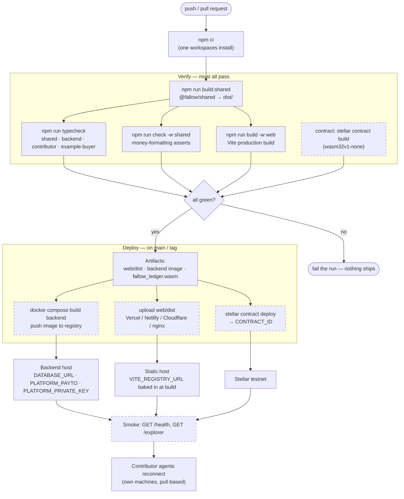

# 🌿 Fallow

**A prepaid compute marketplace for individual contributors — metered in native XLM on Stellar.**

Think Akash or io.net, but for *individuals* instead of data centers. Anyone can rent out their PC's
CPU/RAM/GPU. A renter — human or AI agent — tops up an XLM balance once, rents a node, and gets a
sandboxed SSH session billed by the hour.

No per-action signing. No x402. You pay for the time you actually used.

> **Evaluating this project?** [WHITEPAPER.md](./WHITEPAPER.md) has the full writeup: trust model,
> billing math, the custodial tradeoff, the ledger contract, and the roadmap. This README is about
> running the thing.

## How it works

1. **Sign in** — you sign a nonce with your wallet to prove you control the address.
2. **Top up** — you call `topup(from, amount)` on the Fallow ledger contract. The registry confirms
   the deposit on-chain and credits an off-chain balance.
3. **Rent** — spends from that balance, no signing. You get an SSH command and a countdown.
4. **Release** — the lease is billed once, `elapsed/3600 × hourly rate`, and the contributor is paid
   on-chain minus a platform fee. The sandbox is destroyed.

A lease also ends on its own when the balance runs out, so you can't overdraw.

Nodes are priced in USD per hour (`PRICE_PER_HOUR_USD`) and converted to a stroops/hour rate at a
configurable `XLM_USD_PRICE`. Deposits, charges, and payouts are all kept as history.

## The trust model

A contributor gives *compute*, never filesystem or account access. The boundary isn't a permissions
system — it's an ephemeral Docker container:

- no host filesystem mounts (`-v` is never used)
- no inbound host ports — the sandbox dials *out* over a [bore](https://github.com/ekzhang/bore)
  tunnel for SSH (in local mode it publishes SSH only to `127.0.0.1`)
- nearly all Linux capabilities dropped (`--cap-drop ALL` plus the handful sshd needs, and
  `--security-opt no-new-privileges`)
- hard CPU / memory / PID caps via cgroups
- destroyed the moment the paid lease ends

This is the same containerization trade-off the whole DePIN compute sector runs on. Fallow just makes
it prepaid and individual-scale.

## Architecture


One npm-workspaces monorepo. Each folder is a self-contained piece you can `cd` into:

| Folder | What it is |
|---|---|
| `backend/` | The registry and API. Express + Neon (Postgres) + socket.io. Holds the node registry in memory, serves a free `/explorer`, handles wallet sign-in and top-ups, spends the balance on `/rent/:id`, runs a watchdog that ends a lease when the balance runs out, and pays the contributor on-chain at the end. Only money state hits the DB. |
| `contributor/` | The daemon a contributor runs. Proves node ownership by signing a nonce, heartbeats, and on a lease spins up a hardened Docker SSH sandbox exposed over a bore tunnel — torn down when the lease ends. |
| `web/` | The website. Vite + React + `@creit.tech/stellar-wallets-kit` (Freighter/xBull/…). See below. |
| `example-buyer/` | A headless autonomous "training agent": signs in, tops up if low, discovers, rents, runs a script, releases. Zero clicks. |
| `shared/` | Shared types, the WebSocket contract, and pricing helpers — imported everywhere as `@fallow/shared`. |

What's in the web app:

- **Connect Wallet** in the nav from the landing page on; the address chip opens a dropdown with
  balance, top-up, copy address, history, and disconnect.
- **Explore** — search, sort, and filter live nodes; each card shows an estimated cost per hour
  before you commit.
- **Lease panel** — countdown, a live "X XLM spent so far", the copyable SSH command, and a release
  button behind a confirm. Shown on both Explore and the Dashboard.
- **Dashboard** — lifetime stats, balance chart, and full spend/top-up history.
- **Metrics** — growth charts and leaderboards that highlight your own row (and pin it below the
  list if you're outside the top 20).
- **Contribute** — how to point your own machine at the registry.

## Ledger contract

Every top-up and payout goes through a small Soroban contract on Stellar testnet. It never holds any
money — it moves XLM from one wallet to another and leaves a public record, so anyone can verify a
transfer happened. Nothing hides in a database.

- **Contract ID:** `CC2ISLGUZEIM37F7D7PNXOC2YVCPBN2TVDRYN4DBL7FCT3N2VYKN4ZIA`
- **View it live:** https://stellar.expert/explorer/testnet/contract/CC2ISLGUZEIM37F7D7PNXOC2YVCPBN2TVDRYN4DBL7FCT3N2VYKN4ZIA
- **Source + deploy your own:** [contract/README.md](./contract/README.md)

## The agentic endpoints

- `GET /explorer` — free, so an agent can survey live nodes (specs + price) and pick one itself.
  `GET /leaderboard[?address=G…]` is free too, returning the top 20 plus that address's own rank.
- `POST /rent/:nodeId` — starts an hourly-metered session against the prepaid balance, no per-rent
  signing. Billed once at release, prorated, and auto-stopped when the balance runs out — so an agent
  only ever burns money on compute it actually used. Top up ahead of time with `POST /wallet/topup`.

## Prerequisites

- Node 22+ and npm
- A **Neon** Postgres database (free at [neon.tech](https://neon.tech)) — its connection string is
  `DATABASE_URL`
- A **platform Stellar account** (`G…`) that receives top-ups and pays contributors. Its address is
  `PLATFORM_PAYTO`, its secret seed (`S…`) is `PLATFORM_PRIVATE_KEY` — both come from one
  `npm run keygen`
- A deployed **ledger contract** (`CONTRACT_ID`) — see [contract/README.md](./contract/README.md)
- **Docker**, with the daemon running, for the contributor's SSH sandboxes
- An **SSH client** (built into macOS/Linux/Windows). Public exposure uses an in-container bore
  tunnel, so there's nothing extra to install; use `TUNNEL_MODE=local` when the consumer and agent
  share a machine
- **Stellar testnet** accounts funded with XLM ([Friendbot](https://friendbot.stellar.org/)) — native
  XLM, no trustline or asset opt-in

> Full setup, account prep, and production deployment live in **[DEPLOY.md](./DEPLOY.md)**. The quick
> start below is for local dev.

## Quick start

Install once at the root, then run each piece in its own terminal. Every command has a root shortcut
and also works from inside its own folder.

```bash
npm install
npm run build:shared            # compiles @fallow/shared to dist/ — required before first run
cp .env.example .env            # set DATABASE_URL, PLATFORM_PAYTO, PLATFORM_PRIVATE_KEY
```

```bash
# 1. Backend / registry                          # http://localhost:4000
npm run backend                 # …or:  cd backend && npm run dev

# 2. Contributor agent — generate + fund a key first
npm run keygen                  # prints Address + STELLAR_PRIVATE_KEY  (cd contributor && npm run keygen)
STELLAR_PRIVATE_KEY=<key> PRICE_PER_HOUR_USD=1.0 npm run contributor   # …or:  cd contributor && npm run dev
#   the SSH sandbox image builds on the first rent, then it's cached
#   same machine as the consumer? add TUNNEL_MODE=local

# 3a. Web UI                                      # http://localhost:5173
cp web/.env.example web/.env    # set VITE_REGISTRY_URL (defaults to localhost:4000)
npm run web                     # connect Freighter → Sign in → Top up → Rent → copy the ssh command

# 3b. …or the autonomous agent (its own funded key)
STELLAR_PRIVATE_KEY=<buyer-key> npm run client       # …or:  cd example-buyer && npm run start
```

## Run with Docker

Each piece is its own Compose service. The backend usually lives on a server; a contributor runs on
each machine sharing compute and points at that backend via `REGISTRY_URL` in `.env`.

```bash
cp .env.example .env                     # then set REGISTRY_URL to your backend

docker compose up --build backend        # the backend / registry  → :4000
docker compose up --build contributor    # share THIS machine's compute
docker compose run  --rm   buyer         # one-shot autonomous buyer
```

The contributor doesn't run a Docker of its own. It mounts the host Docker socket and launches each
sandbox as a sibling container on the host daemon, so there's nothing extra to install. Just set
`REGISTRY_URL` (e.g. `http://YOUR_SERVER_IP:4000`) and bring it up.

- **backend** keeps only money state in Neon (`DATABASE_URL`) — no local volume. Set `PLATFORM_PAYTO`
  and `PLATFORM_PRIVATE_KEY` too.
- **contributor** needs no inbound ports in the default `TUNNEL_MODE=bore`. `network_mode: host` is
  only for `TUNNEL_MODE=local`, and on Docker Desktop (Mac/Windows) host networking doesn't share the
  loopback — so for local mode, run the contributor natively with `npm run contributor`.

### Web app (static SPA)

The web app isn't a container. It's a static build you can host anywhere:

```bash
VITE_REGISTRY_URL=http://your-host:4000 npm run build -w web   # → web/dist
```

Drop `web/dist` on Vercel / Netlify / Cloudflare Pages / nginx — full steps in [DEPLOY.md](./DEPLOY.md).

`web/` uses Vite rather than Next.js on purpose: the wallet stack is client-only, so an SPA avoids
SSR/hydration friction.

## Configuration

All Node services read the repo-root `.env`, and each app's own `.env` overrides it. An inline
`FOO=bar npm run …` overrides both. The web app reads `web/.env` (`VITE_*` only, baked in at build
time). See [`.env.example`](./.env.example), [`web/.env.example`](./web/.env.example), and the env
tables in [DEPLOY.md](./DEPLOY.md).

## CI/CD pipeline

> **Status: not automated yet.** There is no `.github/workflows/` in this repo — every gate below runs
> locally today. The diagram is the release path as it exists, drawn so it can be lifted into GitHub
> Actions as-is. Dashed boxes are the steps still done by hand.



Notes on why it's shaped this way:

- **`build:shared` gates everything.** Both the backend and the web app import `@fallow/shared`, so a
  stale `dist/` fails the typecheck rather than shipping a mismatch.
- **Contributor agents are never deployed by the pipeline.** They run on contributors' own machines and
  reconnect to the registry over WebSocket, so a backend deploy just drops their sockets — the node
  re-registers on its next heartbeat.
- **`VITE_REGISTRY_URL` is baked in at build time**, so the web app has to be rebuilt (not just
  re-uploaded) when the backend URL changes.
- **Contract deploys are deliberately manual.** A redeploy mints a new `CONTRACT_ID` that every service
  has to be pointed at, so it should never fire off a merge.

## Demo script (the money shot)

1. Start the **registry** and one **contributor** (a real machine sharing CPU/RAM).
2. Show the node appear in **Explore** at `http://localhost:5173`.
3. **Human path:** connect Freighter (testnet) from the nav → **Sign in** → **Top up** (approve one
   XLM deposit) → watch the balance appear → check the **est. cost per hour** on a node card → click
   **Rent** (no popup) → a copyable **`ssh root@… -p …`** command appears (password = your wallet
   address) with a balance-driven countdown and a **live "X XLM spent so far"** ticking beside it.
   `ssh` in. **Release** (confirm the charge in the prompt) or letting the balance hit zero bills the
   exact time used and destroys the sandbox. The same lease card is on the **Dashboard**.
4. **Autonomous path:** run `npm run client` and narrate the logs — the agent signs in, tops up if
   low, rents the cheapest node, runs a tiny training loop *on someone else's machine*, prints the
   falling loss, then releases and reports how much balance it drew down. No human clicked anything.
5. Show `docker ps` during the lease (a hardened, mount-less container) and that it's **gone** after
   release. On a testnet explorer, confirm the top-up *and* the **payout to the contributor**; in
   Neon, the single `charges` row (with the billed seconds) and the `payouts` row.

## What's verified vs. what needs your machine

Compiles and builds clean: `npm run typecheck`, the web production build, and `npm run check -w shared`
for the money-formatting rules.

Running it end-to-end needs your environment: a Neon database (`DATABASE_URL`), a platform account
(`PLATFORM_PAYTO` + `PLATFORM_PRIVATE_KEY`), a deployed ledger contract (`CONTRACT_ID`), a running
Docker daemon, outbound network for the bore tunnel, an SSH client, and Soroban RPC reachable to
confirm top-ups and send payouts.

## Notes & limitations

- **Custodial model.** Top-ups pool at one platform address and balances are an off-chain ledger in
  Neon. Deposits are confirmed on-chain and recorded by `txid`, so a deposit can't credit twice.
  Contributor earnings *are* settled on-chain at lease end (needs `PLATFORM_PRIVATE_KEY`); without it,
  payouts are recorded as unpaid with a null `txid`.
- **Billing is continuous but charged once**, at lease end, prorated at the hourly rate — no per-tick
  debits. The watchdog only checks every `METER_INTERVAL_MS` whether the balance is exhausted, so
  worst-case over-use is one tick.
- **Nodes and leases live in memory.** A registry restart drops live sessions (the sockets die
  anyway). This is what keeps the DB quiet — heartbeats and the watchdog never write to Postgres.
- **SSH auth is a per-lease password** (your wallet address) on a throwaway root container. Fine for
  ephemeral compute, but it's a password, not a key — use a real key flow for anything sensitive.
- **Spending requires a session token**, minted only after you sign a login nonce, so nobody can
  spend someone else's balance.
